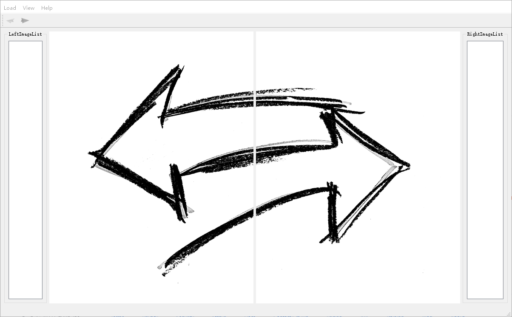
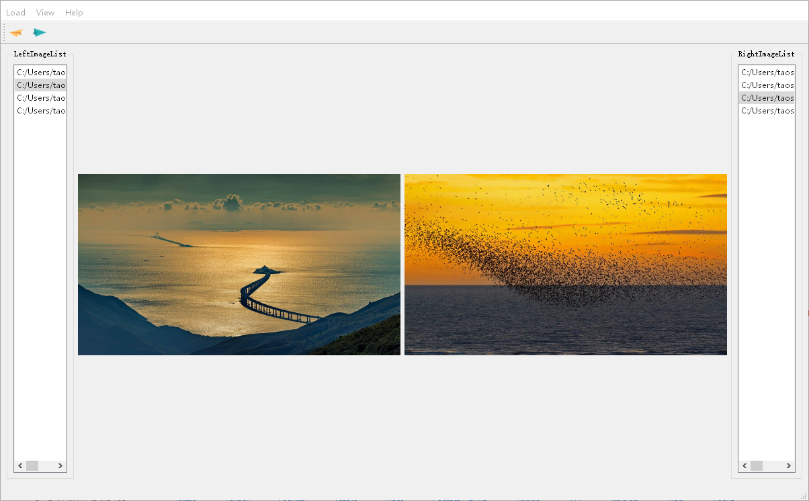

## Double Viewr

This repo is pyqt5 software for compare view two image

main function:

1. show two single image file/image folder/ csv file
2. image item can click for selection and then before/next

## software interface

